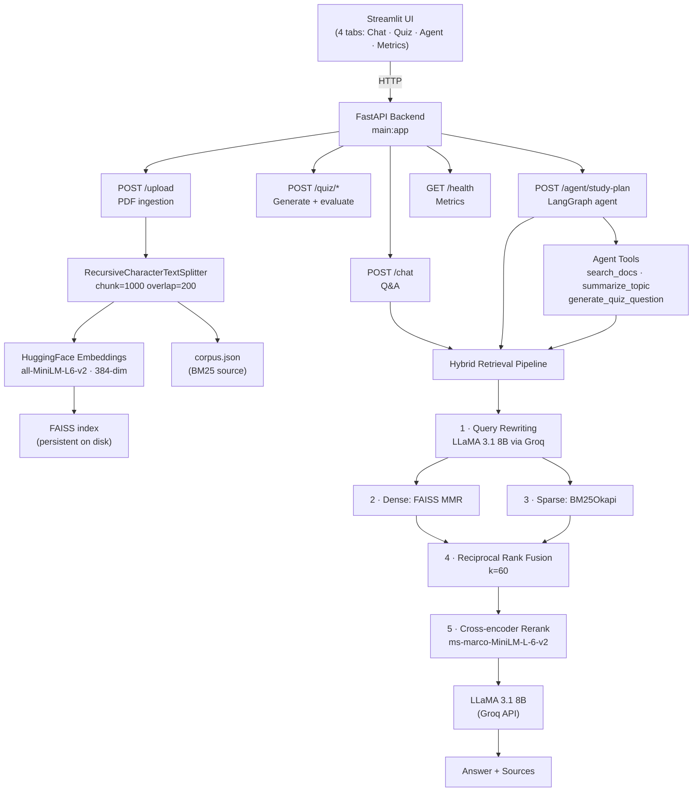

Live Link: https://huggingface.co/spaces/Bhumi987/Personal-Study-Coach
---
title: Personal Study Coach
emoji: 📘
colorFrom: blue
colorTo: purple
sdk: docker
app_port: 7860
pinned: false
---

# Personal Study Coach

A production-grade RAG application that turns any PDF into an interactive study session.
Upload lecture slides or research papers, then chat with them, take AI-generated quizzes, and get a personalised study plan — all powered by a hybrid retrieval pipeline and an autonomous agent.

Built as an AI Engineer portfolio project demonstrating end-to-end ML system design.

---

## Architecture



---

## Tech Stack

| Layer | Technology | Role |
|-------|-----------|------|
| **API framework** | FastAPI + Pydantic | Async REST API, request validation |
| **Frontend** | Streamlit 1.58 | Chat UI, quiz tab, agent tab, metrics dashboard |
| **LLM** | LLaMA 3.1 8B Instant (Groq) | Answer generation, quiz gen, query rewriting, agent reasoning |
| **Embeddings** | `all-MiniLM-L6-v2` (HuggingFace) | 384-dim sentence embeddings, cached singleton |
| **Vector store** | FAISS (faiss-cpu) | Dense retrieval with MMR, persistent index on disk |
| **Sparse retrieval** | BM25Okapi (rank-bm25) | Keyword/exact-term matching, JSON-persisted corpus |
| **Fusion** | Reciprocal Rank Fusion | Merges BM25 + FAISS ranks without score normalisation |
| **Reranker** | cross-encoder/ms-marco-MiniLM-L-6-v2 | High-precision joint (query, doc) relevance scoring |
| **Agent framework** | LangGraph (ReAct) | Autonomous study planner with tool use loop |
| **RAG orchestration** | LangChain LCEL | Pipeline composition via pipe operator |
| **Evaluation** | RAGAS 0.4 | Faithfulness, Answer Relevancy, Context Precision, Context Recall |
| **Package manager** | uv | Fast Python packaging and virtual environments |
| **Containerisation** | Docker + Compose | Two-service stack (API + Streamlit) with volume persistence |
| **Testing** | pytest | Unit tests for retrieval logic + API endpoint integration tests |

---

## Features

### Chat (RAG Q&A)
- Answers grounded strictly in uploaded documents
- Source citations: filename + page number per chunk
- Per-session conversation memory (last 20 messages)
- Follow-up questions using conversation context

### Quiz
- Questions generated from random document chunks
- LLM evaluates answers semantically (not exact match)
- Score 0–100, detailed feedback, model answer shown after submission
- Per-session quiz history

### Study Planner Agent (LangGraph ReAct)
- Accepts a free-text study goal
- Autonomously calls `search_docs` → `summarize_topic` × N → `generate_quiz_question` × N
- Produces a structured study plan: overview, key concepts, quiz questions, study sequence
- Reasoning trace shown in the UI (one expander per tool call)
- Download plan as Markdown

### Metrics Dashboard
- Live API health (FAISS chunk count, BM25 corpus size, retrieval mode)
- RAGAS score cards + bar chart (auto-populated after running `eval/run_eval.py`)
- Retrieval pipeline reference table with per-stage explanation

### Security hardening
- Path traversal prevention (`os.path.basename`) on uploads
- Chunked streaming with 50 MB hard cap
- Generic error messages to clients; full errors logged server-side only
- JSON corpus persistence (not pickle — avoids arbitrary code execution on load)

---

## Retrieval Pipeline — Why 5 Stages?

| Stage | Problem it solves |
|-------|------------------|
| Query rewriting | User phrasing rarely matches document vocabulary |
| FAISS MMR | Semantic similarity + diversity (avoids redundant chunks) |
| BM25 | Exact keyword / acronym / formula matches that embeddings miss |
| RRF (k=60) | Merges BM25 scores (absolute) with FAISS distances (relative) safely |
| Cross-encoder rerank | Bi-encoders embed query + doc independently (fast, approximate); cross-encoder reads them jointly (slow, accurate) — run only on the small fused candidate set |

---

## API Endpoints

| Method | Endpoint | Description |
|--------|----------|-------------|
| POST | `/upload` | Upload and process a PDF (max 50 MB) |
| POST | `/chat` | Ask a question, returns answer + sources |
| GET | `/conversation` | Retrieve session chat history |
| DELETE | `/conversation` | Clear session chat history |
| POST | `/quiz/generate` | Generate a quiz question from documents |
| POST | `/quiz/answer` | Submit answer, returns score + feedback |
| GET | `/quiz/history` | List questions generated this session |
| POST | `/agent/study-plan` | Run the LangGraph study planner agent |
| GET | `/documents` | List documents currently in the index |
| GET | `/health` | Live status: chunks, LLM availability, retrieval mode |

---

## RAGAS Evaluation Results

Run `uv run python eval/run_eval.py` to populate. Evaluates 10 hand-written questions across all loaded documents using Groq LLM as the judge (no OpenAI key needed).

| Metric | Score | What it measures |
|--------|-------|-----------------|
| Faithfulness | — | Answer claims supported by retrieved context |
| Answer Relevancy | — | Answer actually addresses the question asked |
| Context Precision | — | Retrieved chunks were relevant to the answer |
| Context Recall | — | Context covered all key points in the ground truth |

---

## Setup

### Prerequisites
- Python 3.12+
- [uv](https://docs.astral.sh/uv/getting-started/installation/) (`pip install uv`)
- A free [Groq API key](https://console.groq.com)

### Local (recommended)

```bash
git clone https://github.com/B2608/Personal_Study_Coach.git
cd Personal_Study_Coach

# Install all dependencies
uv sync

# Set environment variable
echo "GROQ_API_KEY=your_key_here" > .env

# Terminal 1 — FastAPI backend
uv run uvicorn main:app --port 10000

# Terminal 2 — Streamlit frontend
uv run streamlit run streamlit_app.py
```

Open `http://localhost:8501` in your browser.

### Docker (two-service stack)

```bash
# Build and start API + Streamlit
GROQ_API_KEY=your_key_here docker compose up --build

# API:       http://localhost:10000
# Frontend:  http://localhost:8501
# Swagger:   http://localhost:10000/docs
```

The FAISS index is persisted in a named Docker volume (`faiss_data`) so documents survive container restarts.

### Deploy (Render + Streamlit Cloud)

1. Push to GitHub
2. Deploy FastAPI to Render (free tier, `uvicorn main:app --host 0.0.0.0 --port $PORT`)
3. Deploy Streamlit to [Streamlit Cloud](https://streamlit.io/cloud) (free), set `API_BASE_URL` env var to your Render URL

---

## Running Tests

```bash
# All tests
uv run pytest tests/ -v

# Only retrieval unit tests (no external services needed)
uv run pytest tests/test_retriever.py -v

# Only API tests
uv run pytest tests/test_api.py -v
```

Test coverage:
- **`test_retriever.py`** — 11 tests: BM25 ranking, empty corpus, k limit, case insensitivity; RRF deduplication, rank aggregation, k constant behaviour
- **`test_api.py`** — 16 tests: all endpoints for happy path, 503/400/200 status codes, state injection
- **`test_agent.py`** — 10 tests: all 3 tool functions with mocked state (no retriever, no results, format checks)

---

## Running the Evaluation

```bash
# Make sure the API has run at least once (to create the FAISS index)
uv run uvicorn main:app --port 10000
# Wait for startup, then Ctrl+C

# Run RAGAS evaluation (~3-5 min for 10 questions × 4 metrics)
uv run python eval/run_eval.py
```

Results saved to `eval/ragas_scores.json`. The Metrics tab in the Streamlit UI reads this file automatically.

---

## Project Structure

```
Personal_Study_Coach/
├── main.py                    # FastAPI app + lifespan
├── streamlit_app.py           # Streamlit entry point
├── app/
│   ├── config.py              # All constants + env config
│   ├── state.py               # Shared mutable state (vector_db, llm, ...)
│   ├── api/
│   │   ├── upload.py          # POST /upload
│   │   ├── chat.py            # POST /chat, GET/DELETE /conversation
│   │   ├── quiz.py            # POST /quiz/generate, /quiz/answer, GET /quiz/history
│   │   └── agent.py           # POST /agent/study-plan
│   ├── rag/
│   │   ├── pipeline.py        # Document ingestion, embeddings, QA chain
│   │   └── retriever.py       # BM25, FAISS, RRF, cross-encoder, HybridRetriever
│   └── agent/
│       ├── tools.py           # search_docs, summarize_topic, generate_quiz_question
│       └── graph.py           # LangGraph ReAct graph + step extraction
├── frontend/
│   ├── api_client.py          # HTTP adapter layer (APIError, all calls)
│   ├── chat_tab.py            # Chat UI
│   ├── quiz_tab.py            # Quiz UI
│   ├── agent_tab.py           # Study Planner UI
│   └── metrics_tab.py         # Live health + RAGAS scores
├── eval/
│   ├── test_set.py            # 10 questions + hand-written ground truths
│   ├── run_eval.py            # One-command RAGAS evaluation script
│   └── results.md             # Score schema + run instructions
├── tests/
│   ├── conftest.py            # Fixtures: state reset, mock LLM, fake docs
│   ├── test_retriever.py      # BM25 + RRF unit tests
│   ├── test_api.py            # FastAPI endpoint integration tests
│   └── test_agent.py          # Agent tool unit tests
├── data/                      # Default study PDFs (attention, seq2seq, Python)
├── Dockerfile                 # Single image for API + Streamlit
├── docker-compose.yml         # Two-service local stack
└── req.txt                    # Pinned requirements
```

---

## Challenges and Solutions

| Challenge | Solution |
|-----------|----------|
| BM25 is in-memory only — lost on restart | Persist all chunks as `faiss_index/corpus.json` (JSON, not pickle — avoids security risk) and reload at startup |
| BM25 and FAISS scores are incompatible | Use RRF — rank-based fusion formula that doesn't require normalisation |
| Cross-encoder is slow on large candidate sets | Run it only on the fused top-20, not the full corpus |
| Query vocabulary mismatch | LLM rewrites user question into keyword-rich search query before retrieval |
| RAGAS evaluator defaults to OpenAI | Pass Groq LLM via `LangchainLLMWrapper` + local embeddings via `LangchainEmbeddingsWrapper` |
| LangGraph `ToolMessage` matching | Match tool results to calls by `tool_call_id`, not by position |
| Streamlit reruns on every interaction | Store all mutable state in `st.session_state`; use `st.rerun()` for state transitions |
| Two services need different ports | Single `Dockerfile`, `CMD` overridden per service in `docker-compose.yml` |

---

**Bhumika Sahu** · AI Engineer Portfolio · 2026
